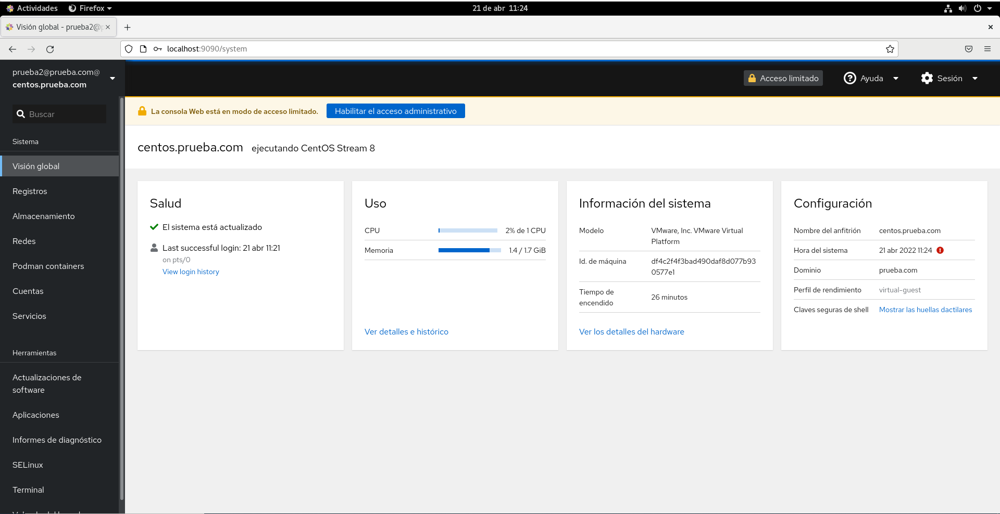

# Configuracion de un CentOs contra un servidor de Active Directory

## Paginas consultadas 

[https://computingforgeeks.com/join-centos-rhel-system-to-active-directory-domain/](https://computingforgeeks.com/join-centos-rhel-system-to-active-directory-domain/)
[https://www.rootusers.com/how-to-join-centos-linux-to-an-active-directory-domain/](https://www.rootusers.com/how-to-join-centos-linux-to-an-active-directory-domain/)
[https://access.redhat.com/discussions/3370851](https://access.redhat.com/discussions/3370851)

## Archivo de Configuracion /etc/krb5.conf
```
[libdefaults]
default_realm = PRUEBA.COM
      dns_lookup_kdc = no
      dns_lookup_realm = false
      default_keytab_name = /etc/krb5.keytab
      rdns=false

; for Windows 2003
      default_tgs_enctypes = rc4-hmac des-cbc-crc des-cbc-md5
      default_tkt_enctypes = rc4-hmac des-cbc-crc des-cbc-md5
      permitted_enctypes = rc4-hmac des-cbc-crc des-cbc-md5
udp_preference_limit = 0

; for Windows 2008 with AES
;      default_tgs_enctypes = aes256-cts-hmac-sha1-96 rc4-hmac des-cbc-crc des-cbc-md5
;      default_tkt_enctypes = aes256-cts-hmac-sha1-96 rc4-hmac des-cbc-crc des-cbc-md5
;      permitted_enctypes = aes256-cts-hmac-sha1-96 rc4-hmac des-cbc-crc des-cbc-md5
;
; for MIT/Heimdal kdc no need to restrict encryption type

[realms]
      PRUEBA.COM = {
              kdc = dc.prueba.com
              admin_server = dc.prueba.com
      }

[domain_realm]
      .linux.home = PRUEBA.COM
      .prueba.com = PRUEBA.COM
      prueba.com = PRUEBA.COM

[logging]
  kdc = FILE:/var/log/kdc.log
  admin_server = FILE:/var/log/kadmin.log
  default = FILE:/var/log/krb5lib.log
```

## Archivo de Configuracion /etc/sssd/sssd.conf

```
[sssd]
domains = prueba.com
config_file_version = 2
services = nss, pam
default_domain_suffix = prueba.com

[nss]
homedir_substring = /home

[pam]


[domain/prueba.com]
ad_domain = prueba.com
krb5_realm = PRUEBA.COM
realmd_tags = manages-system joined-with-adcli 
cache_credentials = True
id_provider = ad
krb5_store_password_if_offline = True
default_shell = /bin/bash
ldap_id_mapping = True
use_fully_qualified_names = True
fallback_homedir = /home/%u@%d
access_provider = ad
```

## Archivo de Resolucion de nombres DNS (/etc/resolv.conf)

```
# Generated by NetworkManager
search prueba.com
nameserver 192.168.79.131 # Direccion IP del Servidor de Active Directory
```

En todos estos archivos hay que substituir donde poner *prueba.com* por el nombre de vuestro dominio; tambien tenemos que tener en cuenta que Linux es CaseSensitive, por lo que debemos de tener en cuenta las letras que estan en mayusculas y las letras que estan en minuscula y poner todo como aparece en estos archivos.


## Loguearse

Para loguearse con esta configuracion solo habria que poner lo siguiente:

```bash
[root@centos ~]# su - prueba2
Creating home directory for prueba2@prueba.com.
[prueba2@prueba.com@centos ~]$ id prueba2
uid=83601109(prueba2@prueba.com) gid=83600513(domain users@prueba.com) grupos=83600513(domain users@prueba.com)
[prueba2@prueba.com@centos ~]$ 
```

Como podemos ver al hacer un id nos dice en los grupos del dominio prueba en los que estamos.

Con los usuarios del dominio tambien podemos loguearnos en la interfaz de administracion web integrada con CentOs(_Cockpit_)



