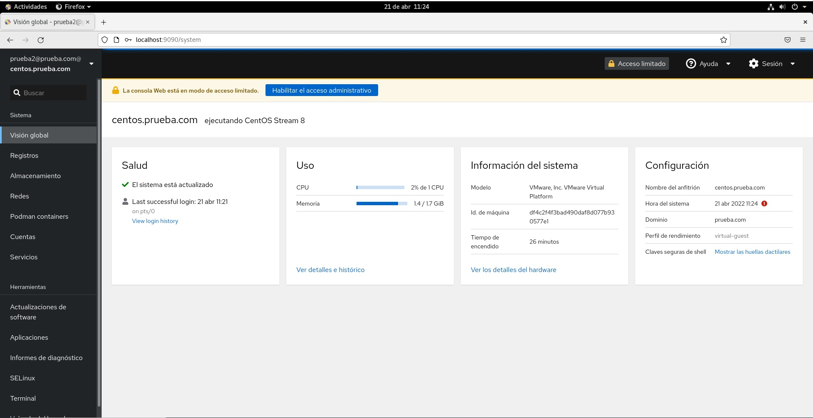

# Configuracion de un CentOs contra un servidor de Active Directory sin que aparezca en la lista de equipos en WServer

## Paginas consultadas 

[https://computingforgeeks.com/join-centos-rhel-system-to-active-directory-domain/](https://computingforgeeks.com/join-centos-rhel-system-to-active-directory-domain/)
[https://www.rootusers.com/how-to-join-centos-linux-to-an-active-directory-domain/](https://www.rootusers.com/how-to-join-centos-linux-to-an-active-directory-domain/)
[https://access.redhat.com/discussions/3370851](https://access.redhat.com/discussions/3370851)

## Archivo de Configuracion /etc/krb5.conf

```bash
#To opt out of the system crypto-policies configuration of krb5, remove the
# symlink at /etc/krb5.conf.d/crypto-policies which will not be recreated.

[logging]
    default = FILE:/var/log/krb5libs.log
    kdc = FILE:/var/log/krb5kdc.log
    admin_server = FILE:/var/log/kadmind.log

[libdefaults]
 default_realm = PRUEBA.COM
 dns_lookup_realm = false
 dns_lookup_kdc = no
 rdns=false

; for Windows 2003
      default_tgs_enctypes = rc4-hmac des-cbc-crc des-cbc-md5
      default_tkt_enctypes = rc4-hmac des-cbc-crc des-cbc-md5
      permitted_enctypes = rc4-hmac des-cbc-crc des-cbc-md5
udp_preference_limit = 0

; for Windows 2008 with AES
;      default_tgs_enctypes = aes256-cts-hmac-sha1-96 rc4-hmac des-cbc-crc des-cbc-md5
;      default_tkt_enctypes = aes256-cts-hmac-sha1-96 rc4-hmac des-cbc-crc des-cbc-md5
;      permitted_enctypes = aes256-cts-hmac-sha1-96 rc4-hmac des-cbc-crc des-cbc-md5
;
; for MIT/Heimdal kdc no need to restrict encryption type

[realms]
 PRUEBA.COM = {
  kdc = dc.prueba.com
  admin_server = dc.prueba.com
 }

[domain_realm]
 .prueba.com = PRUEBA.COM
 prueba.com = PRUEBA.COM
 .linux.home = PRUEBA.COM
```

## Archivo de Configuracion /etc/sssd/sssd.conf

```bash
[sssd]
config_file_version = 2
services = pam, nss, ifp
domains = PRUEBA.COM

[pam]

[domain/PRUEBA.COM]
krb5_keytab = /etc/krb5.keytab
dyndns_update = false
access_provider = ad
id_provider = ldap
ldap_uri = ldap://dc.prueba.com:389
ldap_default_bind_dn = CN=Administrator,CN=Users,DC=prueba,DC=com
ldap_default_authtok_type = password
ldap_default_authtok = Abcd1234.
ldap_access_order = filter
ldap_group_member = member
#ldap_access_filter =( memberOf=CN=GASF_ADMIN_SERVER,OU=Informatica,OU=Grupos,OU=Xestion Integrada de Ferrol,DC=sergas,DC=local)

ldap_schema = ad
ldap_id_mapping = true
ldap_user_search_base = DC=prueba,DC=com
ldap_user_object_class = user
ldap_group_search_base = DC=prueba,DC=com
ldap_group_object_class = Builtin, group
ignore_group_members = false

#ldap_search_timeout=45


ldap_access_order = expire
ldap_account_expire_policy = ad
ldap_force_upper_case_realm = true
fallback_homedir = /home/%d/%u
default_shell = /bin/bash

krb5_canonicalize = false

debug_level = 7
auth_provider = krb5
chpass_provider = krb5
krb5_realm = PRUEBA.COM
krb5_server = dc.prueba.com
krb5_validate = false

```

## Archivo de Resolucion de nombres DNS (/etc/resolv.conf)

```bash
# Generated by NetworkManager
search prueba.com
nameserver 192.168.79.131 # Direccion IP del Servidor de Active Directory
```

En todos estos archivos hay que substituir donde poner *prueba.com* por el nombre de vuestro dominio; tambien tenemos que tener en cuenta que Linux es CaseSensitive, por lo que debemos de tener en cuenta las letras que estan en mayusculas y las letras que estan en minuscula y poner todo como aparece en estos archivos.


## Loguearse

Para loguearse con esta configuracion solo habria que poner lo siguiente:

```bash
[root@centos ~]# su - prueba2
Creating home directory for prueba2@prueba.com.
[prueba2@prueba.com@centos ~]$ id prueba2
uid=83601109(prueba2@prueba.com) gid=83600513(domain users@prueba.com) grupos=83600513(domain users@prueba.com)
[prueba2@prueba.com@centos ~]$ 
```

Como podemos ver al hacer un id nos dice en los grupos del dominio prueba en los que estamos.

Con los usuarios del dominio tambien podemos loguearnos en la interfaz de administracion web integrada con CentOs(_Cockpit_)




